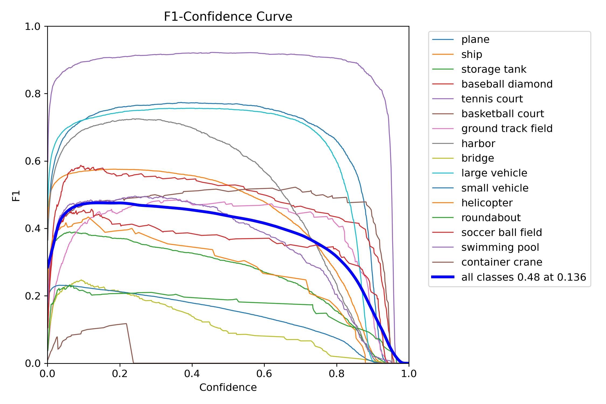
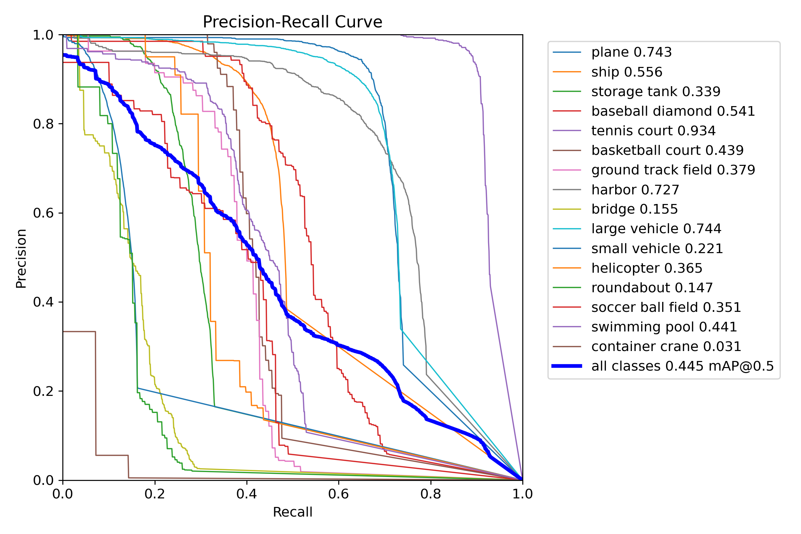
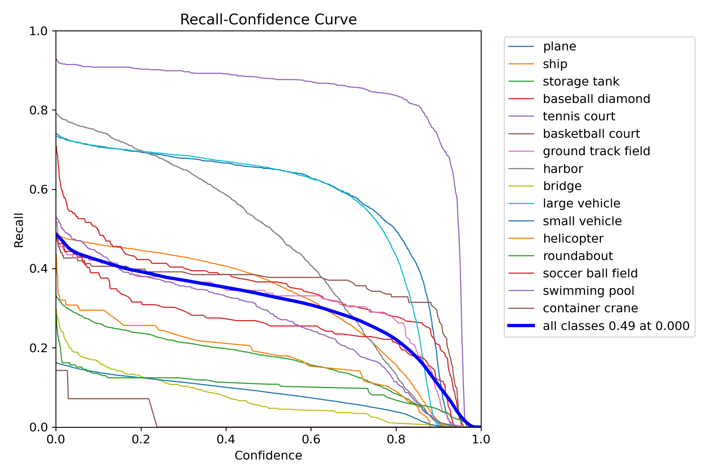
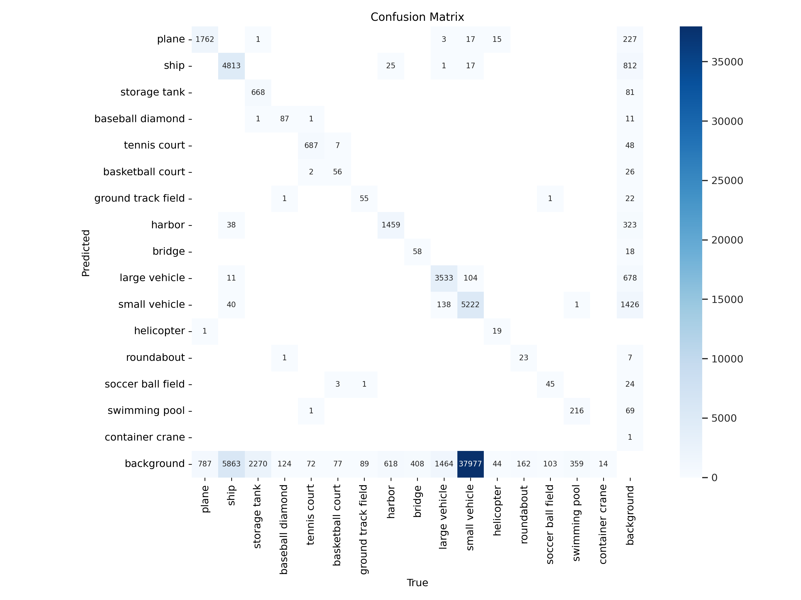
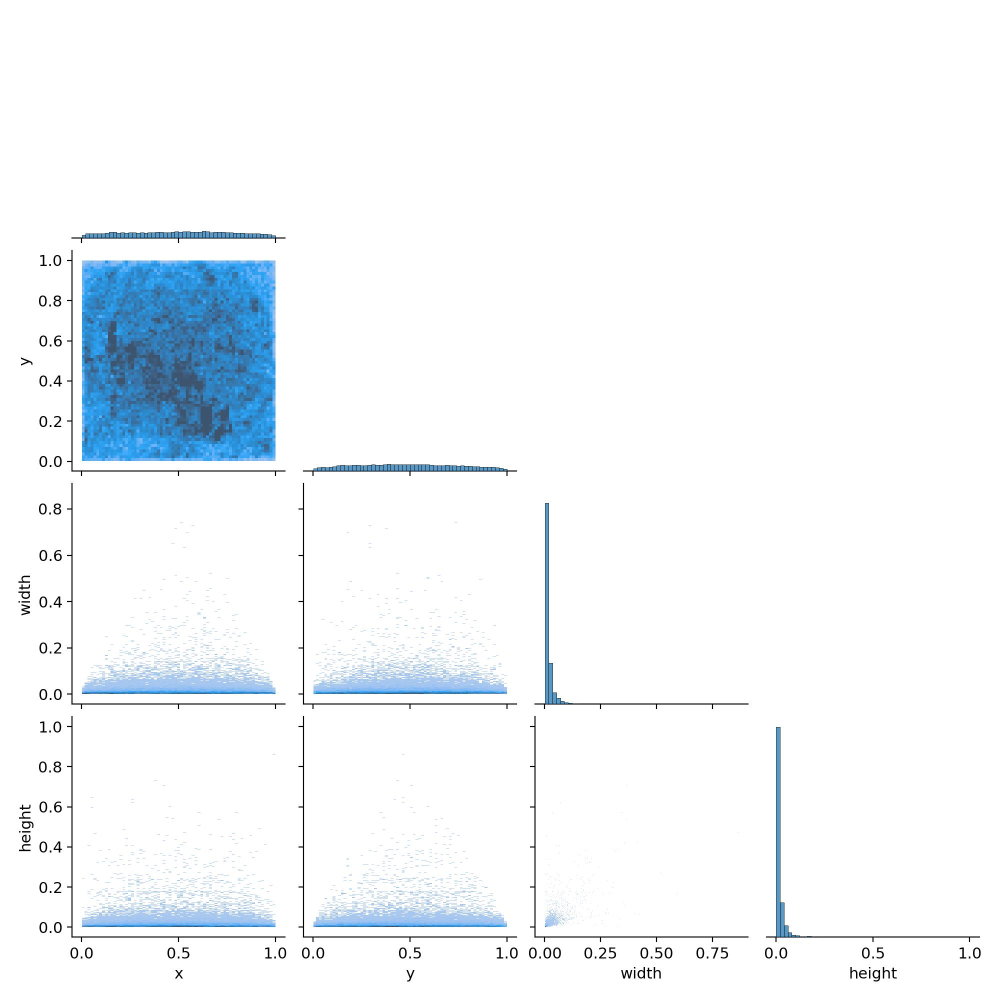
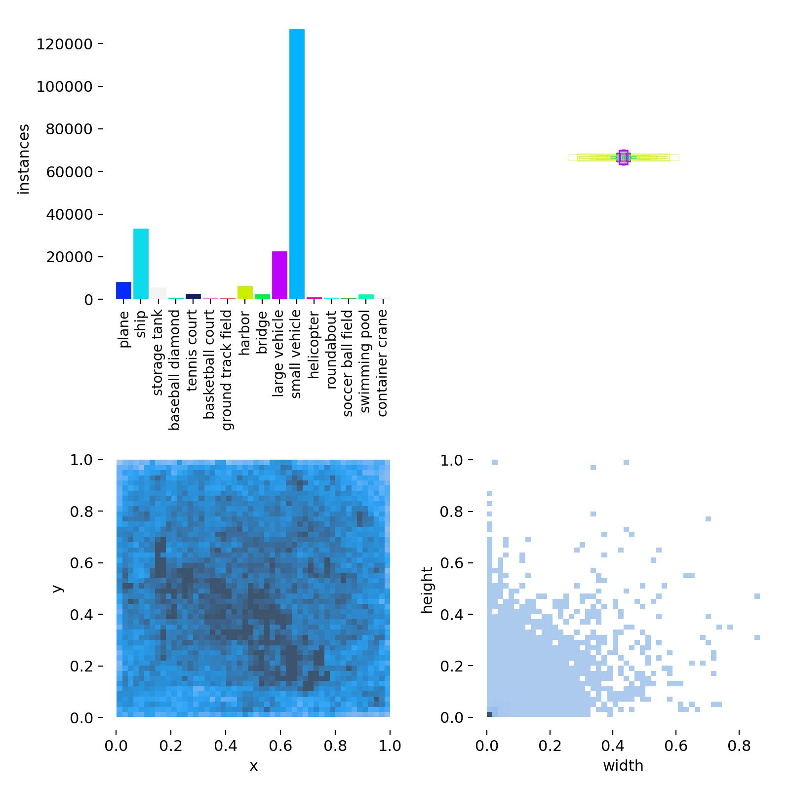

# YOLO Aerial Detection Model

This repository contains a YOLO-based model for aerial object detection. The model is trained to detect and classify various objects from aerial images, such as planes, ships, vehicles, and more. Below are the details and visualizations regarding the performance of the model.

## Model Description

- **Model Name**: YOLO Aerial Mine Detection
- **Framework**: Ultralytics YOLOv11n-obb
- **Languages**: English, Persian
- **Classes Detected**:
  - Plane (هواپیما)
  - Ship (کشتی)
  - Storage Tank (مخزن ذخیره)
  - Baseball Diamond (زمین بیسبال)
  - Tennis Court (زمین تنیس)
  - Basketball Court (زمین بسکتبال)
  - Ground Track Field (زمین دو و میدانی)
  - Harbor (بندرگاه)
  - Bridge (پل)
  - Large Vehicle (خودرو بزرگ)
  - Small Vehicle (خودرو کوچک)
  - Helicopter (هلیکوپتر)
  - Roundabout (میدان)
  - Soccer Ball Field (زمین فوتبال)
  - Swimming Pool (استخر شنا)

## Training Details

- **Dataset**: Custom aerial images annotated for object detection.
- **Metrics**: Precision, Recall, mAP@0.5, F1 Score
- **Training Environment**: Kaggle, GPU-accelerated environment
- **Optimizer**: SGD
- **Libraries Used**:
  - **Ultralytics**: YOLOv11n-obb (version 8.0.0)
  - **Gradio**: For creating the user interface (version 3.1.4)
  - **Pandas**: For data handling (version 1.3.3)
  - **Pillow**: For image manipulation (version 8.4.0)
  - **OpenCV**: For video processing (version 4.5.3)

## Evaluation Results

Below are the various evaluation results obtained during the training and testing phases of the model.

### F1-Confidence Curve


### Precision-Confidence Curve


### Precision-Recall Curve


### Recall-Confidence Curve


### Confusion Matrix


### Labels Correlogram


### Labels Distribution


## How to Use

1. **Clone this repository.**
2. **Load the model using the Ultralytics YOLO library.**
3. **Use the model for object detection on aerial images.**

```python
import cv2
from ultralytics import YOLO
import matplotlib.pyplot as plt
import numpy as np

# Load the YOLO model
model = YOLO('/content/best.pt')

# Predict on an image
results = model.predict(source='/content/boats.jpg', conf=0.3)
obb_results = results[0].obb  # Extract Oriented Bounding Boxes (OBB) from the results

# Load the original image using OpenCV
image = cv2.imread('/content/boats.jpg')

# Check if there are any detection results
if obb_results is not None and len(obb_results.data) > 0:
    # Iterate over each detected object
    for obb, conf, cls in zip(
        obb_results.data.cpu().numpy(), 
        obb_results.conf.cpu().numpy(), 
        obb_results.cls.cpu().numpy()
    ):
        # Extract bounding box parameters
        x_center, y_center, width, height, rotation = obb[:5]
        class_id = int(cls)
        confidence = float(conf)

        # Define the rotated rectangle (bounding box)
        rect = (
            (x_center, y_center),  # Center of the rectangle
            (width, height),       # Size of the rectangle
            rotation * 180.0 / np.pi  # Rotation angle in degrees
        )

        # Get the four corners of the rotated rectangle
        box = cv2.boxPoints(rect)
        box = np.int0(box)  # Convert coordinates to integers

        # Draw the rotated bounding box on the image
        cv2.drawContours(image, [box], 0, (0, 255, 0), 2)  # Green color with thickness 2

        # Put the class ID and confidence score near the bounding box
        cv2.putText(
            image, 
            f'Class {class_id}, Conf {confidence:.2f}', 
            (int(x_center), int(y_center)), 
            cv2.FONT_HERSHEY_SIMPLEX,  # Font type
            0.5,                        # Font scale
            (0, 255, 0),                # Text color (Green)
            1,                          # Thickness of the text
            cv2.LINE_AA                 # Line type for anti-aliasing
        )

    # Convert the image from BGR (OpenCV format) to RGB (Matplotlib format)
    image_rgb = cv2.cvtColor(image, cv2.COLOR_BGR2RGB)

    # Display the image with bounding boxes using Matplotlib
    plt.figure(figsize=(12, 8))
    plt.imshow(image_rgb)
    plt.axis('off')  # Hide axis
    plt.show()
else:
    print("No objects detected.")

 ```

### **License**:

    This model is open-sourced under the MIT License.
    Acknowledgements

Special thanks to the Kaggle community and Hugging Face for providing tools and platforms for developing and sharing this project.

**Create a `requirements.txt` file with the following content:**

    ultralytics==8.0.0 gradio==3.1.4 pandas==1.3.3 Pillow==8.4.0 opencv-python==4.5.3 matplotlib==3.4.3 numpy==1.21.2


**Include instructions in the README on how to install dependencies:**
```markdown
## Installation

To install the required libraries, run:

```bash
pip install -r requirements.txt
```


