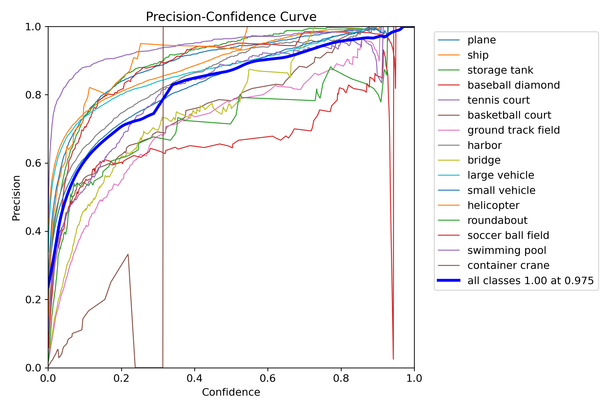

# README File Content for Hugging Face

# YOLO Aerial Detection Model

This repository contains a YOLO-based model for aerial object detection. The model is trained to detect and classify various objects from aerial images, such as planes, ships, vehicles, and more. Below are the details and visualizations regarding the performance of the model.

## Model Description

- **Model Name**: YOLO Aerial Mine Detection
- **Framework**: Ultralytics YOLOv11n-obb
- **Languages**: English, Persian
- **Classes Detected**:
  - Plane (هواپیما)
  - Ship (کشتی)
  - Storage Tank (مخزن ذخیره)
  - Baseball Diamond (زمین بیسبال)
  - Tennis Court (زمین تنیس)
  - Basketball Court (زمین بسکتبال)
  - Ground Track Field (زمین دو و میدانی)
  - Harbor (بندرگاه)
  - Bridge (پل)
  - Large Vehicle (خودرو بزرگ)
  - Small Vehicle (خودرو کوچک)
  - Helicopter (هلیکوپتر)
  - Roundabout (میدان)
  - Soccer Ball Field (زمین فوتبال)
  - Swimming Pool (استخر شنا)

## Training Details

- **Dataset**: Custom aerial images annotated for object detection.
- **Metrics**: Precision, Recall, mAP@0.5, F1 Score
- **Training Environment**: Kaggle, GPU-accelerated environment
- **Optimizer**: SGD
- **Libraries Used**:
  - **Ultralytics**: YOLOv11n-obb (version 8.0.0)
  - **Gradio**: For creating the user interface (version 3.1.4)
  - **Pandas**: For data handling (version 1.3.3)
  - **Pillow**: For image manipulation (version 8.4.0)
  - **OpenCV**: For video processing (version 4.5.3)

## Evaluation Results

Below are the various evaluation results obtained during the training and testing phases of the model.

### F1-Confidence Curve

### Precision-Confidence Curve

### Precision-Recall Curve

### Recall-Confidence Curve

### Confusion Matrix

### Labels Correlogram

### Labels Distribution

## How to Use

1. Clone this repository.
2. Load the model using the Ultralytics YOLO library.
3. Use the model for object detection on aerial images.

python
from ultralytics import YOLO

# Load the trained model
yolo_model = YOLO('yolo11n-obb.pt')

# Perform detection
yolo_model('test_image.jpg')

## License
This model is open-sourced under the MIT License.

## Acknowledgements
Special thanks to the Kaggle community and Hugging Face for providing tools and platforms for developing and sharing this project.
